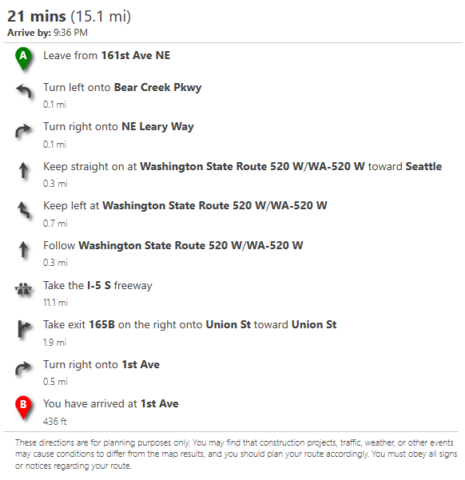
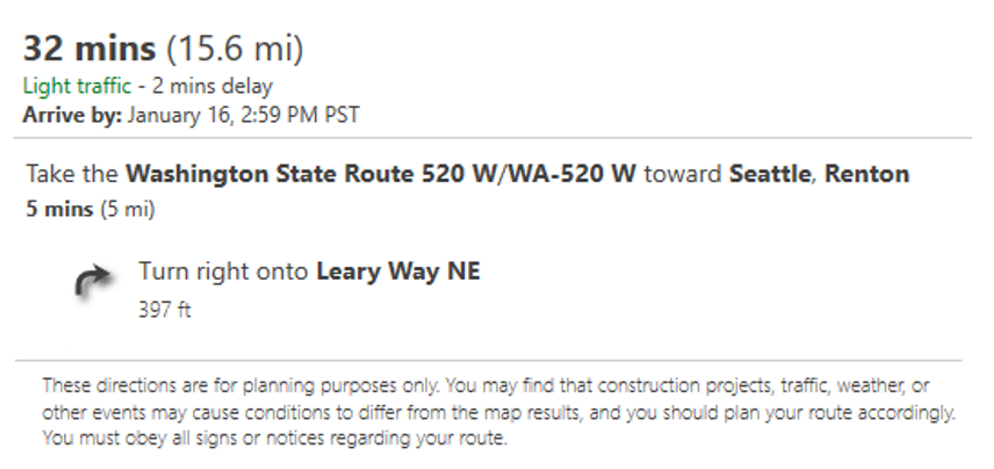
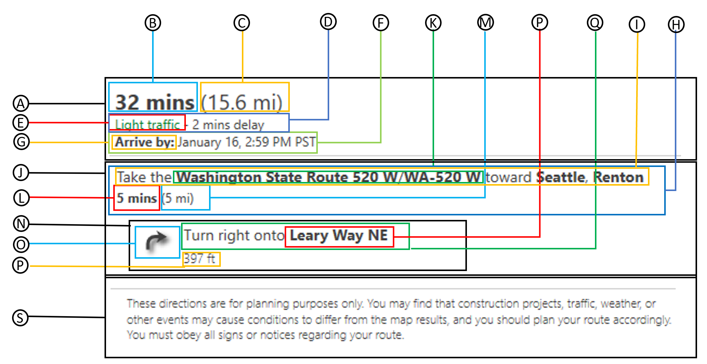

# Route Instruction Control

This control makes it easy to render route instructions as a nicely formatted list. The following is a screenshot of how this control renders instructions by default. 

<p align="center">
    
</p>

## Route instruction control class

The `RouteInstructionControl` class has the following structure. It can take in raw JSON responses from the Azure Maps REST route directions service, or a route directions response object from the Azure Maps Web SDK services module.

**Constructor**

> `atlas.controls.RouteInsturctionControl(options?: RouteInsturctionControlOptions)`

**Methods**

| Name | Return Type | Description | 
|------|-------------|-------------|
| `clear()` | | Clears the route instructions from the control.  | 
| `getOptions()` | `RouteInsturctionControlOptions` | Gets the options of the route instruction control. |
| `getRoute()` | `CalculateRouteDirectionsResponse` | Gets the route response information used in the instruction control. |
| ` onAdd(map: Map, options?: ControlOptions)`| `HTMLELement` | Initialization method for the control which is called when added to a map. |
| `onRemove()` | | Method that is called when the control is removed from a map. Should perform any necessary cleanup for the control. |
| `setOptions(options: RouteInsturctionControlOptions)` | | Sets the options of the route instruction control. |
| `setRoute(routeResponse: CalculateRouteDirectionsResponse)` | Sets the route response information used in the instruction control. |

## Route instruction control Options

The following options can be used to customize how instructions are 

| Name | Type | Description | 
|------|------|-------------|
| `containerId` | string | The ID of a div element to render the instructions in. |
| `displayDisclaimer` | boolean | A boolean indicating whether to display a disclaimer about the accuracy of the route instructions. Default: `true` |
| `groupInstructions` | boolean | Specifies if instruction should be broken up into groups. Default: `false` |
| `langauge` | string | A language to localize to. If not specified, will try and detect an appropriate language. |
| `routeIndex` | number | Specifies which route instructions to display when there are alternative routes. |
| `style` | `'light'` \| `'dark'` | The style to apply to the control. This will be ignored when screen in high contrast mode. Can be `'light'` or `'dark'`. Default: `'light'` |
| `units` | `'auto'` \| `'metric'` \| `'imperial'` | The distance units to display. Can be:<br/> - `'auto'`: will try and detect an appropriate unit.<br/> - `'metric'`: specifies usage of the metric system. Distances are shown using kilometers and meters.<br/> - `'imperial'`: specifies usage of the Imperial (English) system. Distances are shown using miles and feet.<br/>Default: `'auto'` |
| `waypointTextFormat` | `'number'` \| `'letter'` | Specifies the format of the waypoint label text over the manuever icon. <br/> - number: A value between 1 and 150 will be displayed.<br/> - letter: A letter representation between A and ET (index 150), will be displayed.<br/>Default: `'letter'` |

## How to use

Start by adding a reference to the JavaScript and CSS files for the `atlas-services-ui` module to your web application. Next create an instance of the `RouteInstructionControl` class and eithe rpass in an ID of a HTML element to render the control in as an option, or pass it into the Azure Maps Web SDK map control using the `map.controls.add` function. To render route instructions, pass in the JSON response from the Azure Maps REST route directions service or a `CalculateRouteDirectionsResponse` object from the Azure Maps services module into the `setRoute` function. 

**Note:** By default the route service only returns the coordinates for a route path. To return instructions you must set the `instructionsType` parameter when requesting a route. This control works best when this parameter is set to `tagged` or `text`.

The following example calls the Azure Maps REST route directions service using the `fetch` API and renders the instructions in a `div` with ID `instructionPanel`.

```html
<!DOCTYPE html>
<html lang="en">
<head>
    <title></title>

    <!-- Add references to the module. -->
    <link rel="stylesheet" href="../dist/atlas-services-ui.min.css" type="text/css" />
    <script src="../dist/atlas-services-ui.js"></script>
</head>
<body>
    <div id="instructionPanel"></div>

    <script>
        //Create an instance of the route instruction control and bind it to the instructionsPanel div. 
        var cnt = new atlas.control.RouteInsturctionControl({
            containerId: 'instructionPanel'
        });

        //Create REST URL request for route.
        var request = 'https://atlas.microsoft.com/route/directions/json?api-version=1.0&instructionsType=tagged';

        //Coordinates are formatted as "latitude1,longitude1:latitude2,longitude2".
        request += `&query=47.674875,-122.125551:47.608845,-122.340056`

        request += '&subscription-key=<Your Azure Maps Key>';

        /*Process request*/
        fetch(request).then(function (response) {
            return response.json();
        }).then(function (response) {

            //Pass the route response into the route instructions panel.  
            cnt.setRoute(response);
        });
    </script>
</body>
</html>
```

The following example uses the Azure Maps services module to calculate a route and renders the instructions in a `div` with ID `instructionPanel`.

```html
<!DOCTYPE html>
<html lang="en">
<head>
    <title></title>

    <!-- Add a reference to the Azure Maps Services Module JavaScript file. -->
    <script src="https://atlas.microsoft.com/sdk/javascript/service/2/atlas-service.min.js"></script>

    <!-- Add references to the module. -->
    <link rel="stylesheet" href="../dist/atlas-services-ui.min.css" type="text/css" />
    <script src="../dist/atlas-services-ui.js"></script>
</head>
<body>
    <div id="instructionPanel"></div>

    <script>
        //Create an instance of the route instruction control and bind it to the instructionsPanel div. 
        var cnt = new atlas.control.RouteInsturctionControl({
            containerId: 'instructionPanel'
        });

        //Construct the RouteURL object
        var routeURL = new atlas.service.RouteURL(atlas.service.MapsURL.newPipeline(new atlas.service.SubscriptionKeyCredential('<Your Azure Maps Key>')));

        //Coordinates of all waypoints to route through. Coordinates are in the format [longitude, latitude].
        var coordinates = [
            [-122.125551, 47.674875],  //Start: Redmond, WA
            [-122.340056, 47.608845]   //End: Seattle, WA
        ];

        //Route options.
        var options = {
            instructionsType: 'tagged'
        };

        //Calculate a route. 
        routeURL.calculateRouteDirections(atlas.service.Aborter.timeout(10000), coordinates, options).then((response) => {

            //Pass the route response into the route instructions panel.  
            cnt.setRoute(response);
        });
    </script>
</body>
</html>
```

## Custom styling

Much of the route instructions UI can be styled by overriding CSS styles that are defined in the `atlas-services-ui.css` file.

Take for example the following simmple route UI.

<p align="center">

</p>

The following is a breakdown of all the CSS classes available for styling different componets of the UI. 

<p align="center">
    
</p>

|    | CSS class name | Description |
|----|----------------|-------------|
| A | `route-summary` | Route summary. |
| B | `route-summary-time` | Total travel time. |
| C | `route-summary-distance` | Total travel distance. |
| D | `route-summary-traffic-time` | Traffic delay information. |
| E | `route-summary-traffic-light`<br/>`route-summary-traffic-moderate`<br/>`route-summary-traffic-heavy` | The traffic level description. |
| F | `route-summary-arrive-by` | The arrive by information. |
| G | `route-summary-arrive-by-label` | The arrive by label. |
| H | `route-instruction-group`| A group of route instructions. |
| I | `route-instruction-group-desc`| Instruction group top level description. |
| J | `route-instruction-group-msg`| Instruction group message. |
| K | `route-instruction-street`<br/>`route-instruction-roadNumber`<br/>`route-instruction-exitNumber`<br/>`route-instruction-signpostText`<br/>`route-instruction-roundaboutExitNumber` | A tagged key phrase in the route instruction message. The `instructionsType` option of the routing service must be set to `tagged` to get these. All XML tags are replaced with a `span` element with one of these CSS class names. |
| L | `route-instruction-group-time` | The travel time of the group of instructions. |
| M | `route-instruction-group-distance` | The travel distance of the group of instructions. |
| N | `route-instruction` | A route instruction. |
| O | `route-maneuver` | A route manuever icon. |
| P | `route-instruction-street`<br/>`route-instruction-roadNumber`<br/>`route-instruction-exitNumber`<br/>`route-instruction-signpostText`<br/>`route-instruction-roundaboutExitNumber` | A tagged key phrase in the route instruction message. The `instructionsType` option of the routing service must be set to `tagged` to get these. All XML tags are replaced with a `span` element with one of these CSS class names. |
| Q | `route-instruction-msg` | Instruction message. |
| R | `route-instruction-distance` | Instruction distance. |
| S | `route-disclaimer` | A disclaimer message about route accuracy and obeying traffic laws. |


### Customize icons

All manuever icons styles can be customized using CSS classes `route-maneuver`, `route-maneuver-text` and `route-maneuver-[maneuver]` where `[maneuver]` is the name of the maneuver. For example, an instruction with an 'ARRIVE' maneuver will have the following CSS class `route-maneuver-ARRIVE`. A full list of possible guidance maneuvers is [documented here](https://docs.microsoft.com/rest/api/maps/route/getroutedirections#guidancemaneuver). Instructions for departure, arrivial or intermediate waypoints have a text element rendered above the icon. This can be styled using the `route-maneuver-text` CSS class. All icons are SVG's and common style to customize are the size, fill and stroke colors. For example, the following CSS can be used to make all maneuver icons red.

```CSS
.route-maneuver svg {
    fill: red;
    stroke: red;
}
```

If you want to change the style of a single icon, you can use the more CSS class name that has the maneuver name appended to it, as shown below.

```CSS
.route-maneuver-ARRIVE svg {
    fill: red;
    stroke: red;
}
```

**Note:** Icons are embedded SVG's as this makes it easier to apply CSS styles to them. To replace these icons with custom images you will need to replace the SVG strings in the `EmeddedIcons.ts` file and rebuild the project.

Here is a table of all maneuver's and the default built-in icon.

| Maneuver | Icon |
|----------|------|
| ARRIVE<br/>DEPART<br/>WAYPOINT_REACHED |  |
| BEAR_LEFT |  |
| BEAR_RIGHT |  |
| ENTER_HIGHWAY<br/>ENTER_MOTORWAY<br/>ENTER_FREEWAY<br/>ENTRANCE_RAMP |  |
| KEEP_LEFT |  |
| KEEP_RIGHT |  |
| MAKE_UTURN<br/>TRY_MAKE_UTURN |  |
| MOTORWAY_EXIT_LEFT |  |
| MOTORWAY_EXIT_RIGHT |  |
| ROUNDABOUT_BACK |  |
| ROUNDABOUT_CROSS |  |
| ROUNDABOUT_RIGHT |  |
| ROUNDABOUT_LEFT |  |
| SHARP_LEFT |  |
| SHARP_RIGHT |  |
| STRAIGHT<br/>FOLLOW |  |
| SWITCH_MAIN_ROAD<br/>SWITCH_PARALLEL_ROAD |  |
| TAKE_FERRY |  |
| TURN_LEFT |  |
| TURN_RIGHT |  |
| WAYPOINT_LEFT<br/>ARRIVE_LEFT |  |
| WAYPOINT_RIGHT<br/>ARRIVE_RIGHT |  |

The following icons will be used in countries where vehicles drive on the left side of the road (i.e. UK).

| Maneuver | Icon |
|----------|------|
| ROUNDABOUT_CROSS |  |
| ROUNDABOUT_RIGHT |  |
| ROUNDABOUT_LEFT |  |
| ROUNDABOUT_BACK |  |
| MAKE_UTURN |  |

**Additional notes**

- `TAKE_EXIT` will use the same icon as `MOTORWAY_EXIT_LEFT` or `MOTORWAY_EXIT_RIGHT` depending on the drive side information.

## Examples

The following examples show how to use this UI control: 

- [simple-rotue-instructions](../examples/Simple%20route%20instructions.html)
